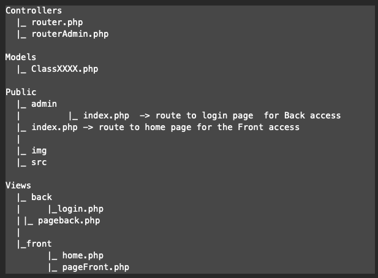

# Berry LAB 18
## Presentation
### Berry Lab 18 presentation:
Non-profit association under the French law of 1901

Digital field

Constant training and skills sharing

Courses given by former members of the association

### Client request:
Increase visibility

Recruit new members

Promote their activities

Comply with the graphic charter of the logo

### Objectives:
Create a showcase website to promote the association

Provide all necessary information

Make a modern, practical and easy-to-understand website

Target adults

## Technologies used:
The languages used are: HTML, PHP, CSS for the Front office and PHP and SQL for the Back office in structure MVC.

### MVC architecture
This section should explain how the site uses the MVC (Model-View-Controller) model to separate the business logic, presentation and controller.
The model represents the data and business logic of the site.
The view is responsible for displaying the data to the user.
The controller handles HTTP requests and coordinates interactions between the model and the view.

* **Site structure or hierarchy:**

## Installation
* **Procedure for installing a database on a database management system:**

The SQL script code can be generated using the Looping software after modeling and appropriate encoding (MySQL), or it can be hand-coded.
We therefore have a .sql file.
For integration into an Apache server in a PHP development, phpMyAdmin must be installed on the server.
Start the server or virtual server with phpMyAdmin. Check that the version of PHP is compatible with the project linked to the SQL to be integrated.
Open an internet browser and enter the link "localhost/phpmyadmin" (or the domain name or IP address instead of localhost for a server). Enter the login credentials (login: "root" and password: "" for a first connection). With MAMP, click on the Webstart button and then on the Tools and phpMyAdmin links, and enter the login credentials.
When the database tree structure appears, click on the "Create new database" button or link and enter the name of the project (ideally). Then go to the SQL tab and copy and paste the code from the sql file into the script area of the page. Once the code has been copied, click on the "Execute" button at the bottom of the page.
To verify: Check for the presence of tables in the project tree structure in phpMyAdmin. The UML modeling can also be viewed on the appropriate tab.
Remember to protect the connection to phpMyAdmin with a password.

* **Back-end code for Berry Lab 18 project to manage administration pages:**

CREATE TABLE Membre( ID_membre INT, nom_membre VARCHAR(50), prenom_membre VARCHAR(50), email_membre VARCHAR(50), PRIMARY KEY(ID_membre) );
CREATE TABLE Commentaire( ID_commentaire VARCHAR(250), commentaire VARCHAR(250), ID_membre INT NOT NULL, PRIMARY KEY(ID_commentaire), FOREIGN KEY(ID_membre) REFERENCES Membre(ID_membre) );

CREATE TABLE Formation( ID_formation INT, libel_formation VARCHAR(50), ID_membre INT NOT NULL, PRIMARY KEY(ID_formation), FOREIGN KEY(ID_membre) REFERENCES Membre(ID_membre) );
CREATE TABLE Outil( ID_outil INT, libel_outil VARCHAR(50), photo_outil VARCHAR(50), description_outil VARCHAR(150), ID_membre INT NOT NULL, PRIMARY KEY(ID_outil), FOREIGN KEY(ID_membre) REFERENCES Membre(ID_membre) );

CREATE TABLE Realisation( ID_realisation INT, libel_realisation VARCHAR(50), description_realisation VARCHAR(150), photo_realisation VARCHAR(50), ID_outil INT NOT NULL, PRIMARY KEY(ID_realisation), FOREIGN KEY(ID_outil) REFERENCES Outil(ID_outil) );

CREATE TABLE Administrateur ( ID_administrateur int(11), nom_admin varchar(50), prenom_admin varchar(50), password varchar(50), PRIMARY KEY(ID_administrateur))

The provided SQL code creates several tables for managing administration pages in the Berry Lab 18 project. The tables include Membre, Commentaire, Formation, Outil, Realisation, and Administrateur. Each table has a primary key and foreign keys to establish relationships between the tables. The code uses VARCHAR and INT data types for the table columns, and specifies NOT NULL constraints for certain columns. The code also includes a password column in the Administrateur table for authentication purposes.

## Usage
* **Site navigation:**

***The home page is displayed at the URL. The navigation buttons at the top of the page provide access to the following pages:***

**-Contact:** This page has a membership registration form with a reminder of the training and tools in an annex.

**-Gallery:** Detailed display of achievements with associated explanations.

**-Legal notices:** Classical page.

**-Services:** Presentation of training and workshops with associated explanations.

***The URL/admin displays the login page for the site administration function. After entering the correct password, the following pages are available:***

**-IndexAdministrateur:** With the possibility to edit, modify or create the "details" of a site administrator.

**-IndexFormation:** With the possibility to edit, modify or create the "details" of a training on the site.

**-IndexMembre:** With the possibility to edit, modify or create the "details" of a member if necessary on the site.

**-IndexOutil:** With the possibility to edit, modify or create the "details" of a tool or workshop on the site.

**-IndexRealisation:** With the possibility to edit, modify or create the "details" of a realization if on the site.

***Note on the Back:*** The "details" are a title, a photo and a description. The database will have links to the images in the image directory.

## Contribution

## License
This site will not be licensed because it was developed solely for educational purposes.

